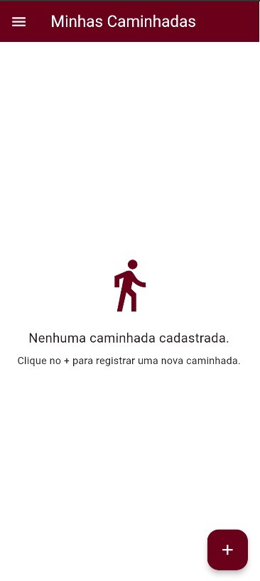
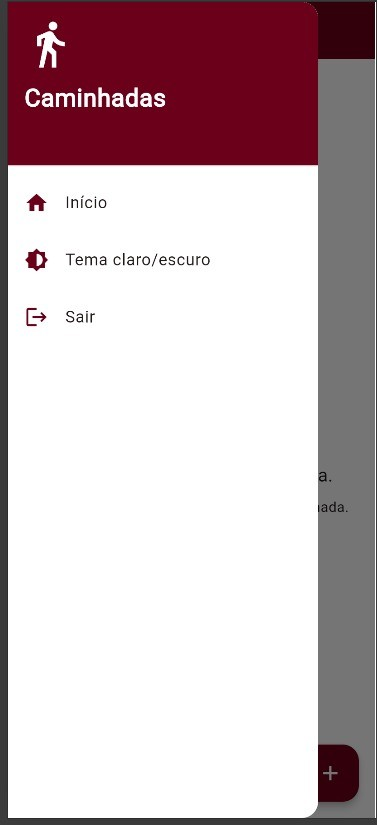
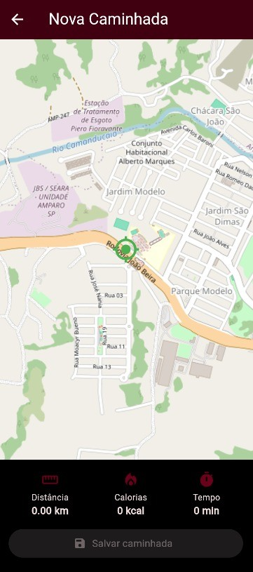
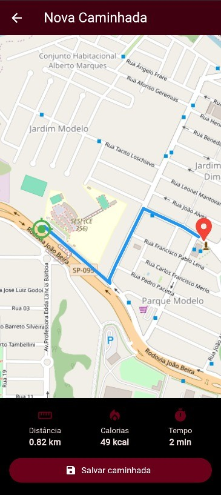
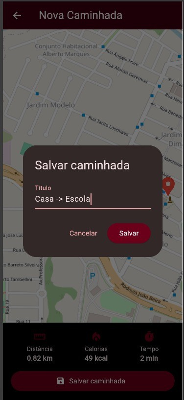
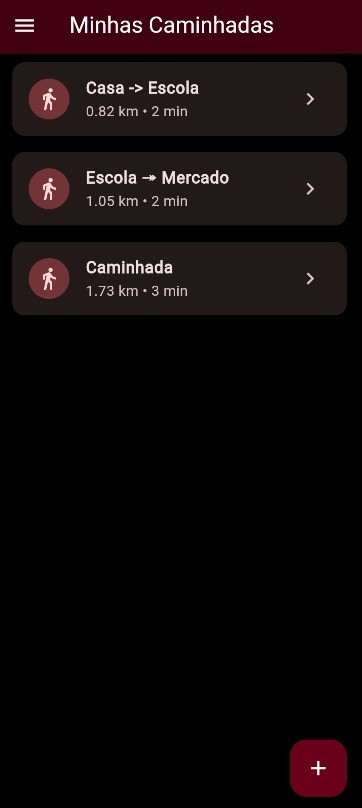

# App Caminhadas

## Sobre o projeto

O **App Caminhadas** foi desenvolvido como atividade da disciplina de **PPDM 2 - Aula 05**, com o objetivo de aplicar conceitos de desenvolvimento mobile e utilização de mapas e localização.

Com o aplicativo, o usuário pode:

- Obter sua localização atual;
- Visualizar o mapa;
- Escolher um destino para a caminhada;
- Registrar uma nova caminhada;
- Visualizar a distância percorrida;
- Visualizar o tempo estimado;
- Visualizar as calorias estimadas;
- Adicionar uma foto à caminhada;
- Consultar as caminhadas salvas;
- Alternar entre tema claro e escuro.

---

## Tecnologias utilizadas

- **Flutter**
- **Dart**
- **Flutter Map**
- **OpenStreetMap**
- **Geolocator**
- **LatLong2**
- **Image Picker**
- **Shared Preferences**
- **APIs de localização e rotas**

## Como executar o projeto
1. Clonar o repositório

```text
git clone COLE_AQUI_O_LINK_DO_SEU_REPOSITORIO
```

2. Entrar na pasta do projeto

```text
cd app_caminhadas
```

3. Instalar as dependências

```text
flutter pub get
```

4. Verificar se o Flutter está configurado

```text
flutter doctor
```

5. Executar o aplicativo
Para executar no dispositivo conectado:

```text
flutter run
```

## Prints

- **Inicio**
- 

- **Home**
- 

- **Home, Tema: Claro**
- 

- **Menu Lateral**
- 

- **Nova Caminhada**
- 

- **Rota Escolhida**
- 

- **Salvar Caminhada**
- 

- **Minhas Caminhadas**
- 

# Autora

Caroline Silva

Projeto desenvolvido para a disciplina de PPDM 2 - Desenvolvimento de Sistemas.
